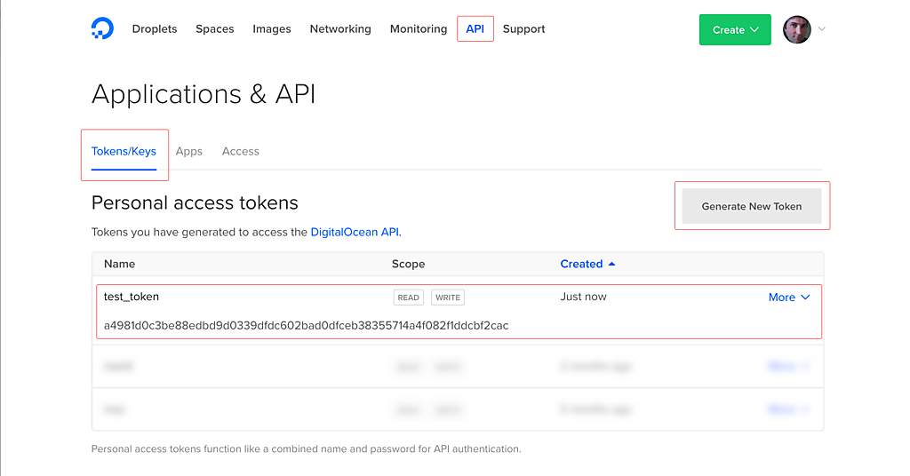
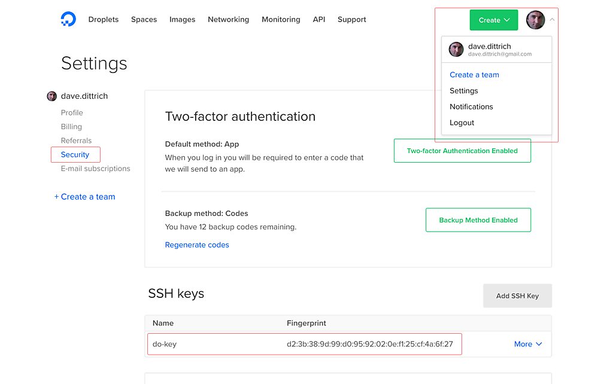

.. _clouddevelopment:

Developing in the Cloud
=======================

This section covers deployment and development using a cloud
service provider.

Developing on DigitalOcean
--------------------------

This chapter covers development or prototype deployment on the
`DigitalOcean`_ platform using Hashicorp `Terraform`_.

Control of Digital Ocean droplets using these playbooks is done in the
subdirectory ``do/dims/`` beneath the root directory of the cloned repository.
(This document assumes an environment variable ``$PBR`` points to the
repository root.)

A helper ``Makefile`` and related scripts facilitate most of the steps used for
creating and controlling DigitalOcean droplets using DigitalOcean's remote
API.  This remote API is accessible directly using programs like ``dopy``
or ``curl``, or indirectly using ``terraform``.

.. note::

    The ``Makefile`` has built-in help text that serves as a reminder of
    capabilities it supports.

    .. code-block:: none

        Usage: make [something]

        Where 'something' is one of these:

         help - print this help text
         init - initialize terraform state (this is automatic)
         droplets - show list of active droplets using digital_ocean.py dynamic inventory
         hosts - show list of hosts in group 'do'
         images - lists available DigitalOcean images
         regions - lists available DigitalOcean regions
         provider - generate terraform provider.tf file for creating nodes in group 'do'

         plan - show the terraform plan for the current state
         graph - generate terraform graph (output is 'graph.png')
         newkeypair - generate a new SSH user keypair
         insertpubkey - insert SSH public key on DigitalOcean
         removepubkey - remove SSH public key on DigitalOcean
         create - applies terraform plan to create droplets for hosts in group 'do'
         bootstrap - create, then run bootstrap.yml and ca-certs.yml playbooks
         installcerts - run 'certbot-installcert.yml' playbook to install SSL certs
         deploy - run 'master.yml' playbook to deploy roles on droplets

         update - update packages
         reboot - reboot the system in +1 minute
         cancel - cancel rebooting (if you REALLY DIDN'T MEAN IT)

         addhostkeys - adds SSH host public keys to selected known_hosts files
         removehostkeys - removes SSH host public keys from selected known_hosts files

         dumpvars - produces Ansible debug output of vars for hosts in group 'do'
         ping - does Ansible ad-hoc ping of hosts in group 'do'
         pre.test - run pre-requisite tests for using terraform with DigitalOcean
         post.test - run 'test.runner --terse' on all droplets

         destroy - destroys droplets for hosts in group 'do'
         spotless - remove terraform log and state files

         * The default if you just type 'make' is the same as 'make help'
         * To control Ansible, set DIMS_ANSIBLE_ARGS to the arguments you want
           to pass along on the command line, for example:
             $ make DIMS_ANSIBLE_ARGS="--tags tests --limit purple" deploy
             $ make DIMS_ANSIBLE_ARGS="--limit purple" post.test

    ..

..

.. _gettingstarted:

Getting Started
~~~~~~~~~~~~~~~

Before being able to remotely create and control DigitalOcean droplets and
related resource, you need to have credentials, programs, and specific
configuration settings (including passwords) for your deployment.

.. note::

    Some of these steps are performed by a ``bootstrap`` role, but
    you have to have already set up and configured Ansible and
    set variables for the host being set up in order to use
    that mechanism. Those steps are covered in Section
    :ref:`localdevelopment`. This section walks you through
    doing them manually. Once you are comfortable with managing
    the Ansible inventory, you can leverage Ansible for
    bootstrapping systems.

..

+ Set up an account on DigitalOcean. (If you do not yet have a
  DigitalOcean account and want to try it out with $10 credit,
  you may use this referral link https://m.do.co/c/a05d1634982e).

+ Create a DNS domain to use for your development deployment and configure the
  domain's **Nameservers** entries to point to DigitalOcean's NS servers
  (``NS1.DIGITALOCEAN.COM``, ``NS2.DIGITALOCEAN.COM`` and
  ``NS3.DIGITALOCEAN.COM``).  This is necessary for allowing Terraform to
  use DigitalOcean's API to create and set DNS ``A``,
  ``MX``, and ``TXT`` records for your droplets.  (You will set an
  environment variable in a moment with this domain name.)

  After a short period of time after creating the domain, you should
  be able to see the NS records:

  .. code-block:: none

    $ dig example.com ns | grep NS
    example.com.         1799    IN      NS      ns3.digitalocean.com.
    example.com.         1799    IN      NS      ns1.digitalocean.com.
    example.com.         1799    IN      NS      ns2.digitalocean.com.

  ..

  .. note::

     There are many domain name registrars you can use. Factors such as
     requirements for specific TLD names, longevity of use, cost,
     existing DNS services already available to you, etc., will guide
     your choice. For short-term development and testing, you can use
     one of the "free" TLD registrars (e.g., `Freenom`_).

  ..

.. _Freenom: http://www.dot.tk/en/index.html

+ Ensure that your ``~/.bash_aliases`` (or ``~/.bashrc``, depending
  on how your operating system's Bash installation handles its
  resource files) has environment variables set up with the
  following variables.

  .. code-block:: bash

      export PBR="/path/to/where/you/put/ansible-dims-playbooks"
      export DIMS_DOMAIN="example.com"

      # For dopy
      export DO_API_VERSION="2"
      export DO_API_TOKEN="$(cat ~/.secrets/digital-ocean/token)"

      # For terraform
      export DO_PAT=${DO_API_TOKEN}
      export TF_VAR_do_token="${DO_PAT}"
      export TF_VAR_region="sfo2"  # See output of "make regions" for available regions
      export TF_VAR_name="do"
      export TF_VAR_domain="${DIMS_DOMAIN}"
      export TF_VAR_datacenter="${TF_VAR_domain}"
      export TF_VAR_private_key="${HOME}/.ssh/${TF_VAR_name}"
      export TF_VAR_public_key="${TF_VAR_private_key}.pub"
      export TF_VAR_ssh_fingerprint="$(ssh-keygen -E md5 -lf ${TF_VAR_public_key} | awk '{print $2}' | sed 's/^[Mm][Dd]5://')"

  ..

  .. note::

      Just editing this file does not change any currently set environment variables
      in active shells, so Bash must be forced to re-process this file. Either
      run ``exec bash`` in any active shell window to restart the Bash process,
      or log out and log back in. You may need to do this several times as you
      are configuring everything the first time.

  ..

+ Make sure operating system software pre-requisites are present.

  .. code-block:: none

      $ sudo apt-get install bats pip python-pip jq
      $ sudo pip install ansible==2.4.0.0

  ..

+ `Install Terraform`_ for your OS. Test the ``terraform`` installation and
  other tools by initializing the directory form within the ``deploy/do``
  directory:

  .. code-block:: none

      $ cd $PBR/deploy/do
      $ make init

  ..

  This step does a few things, including initializing ``terraform`` and
  ensuring that a directory for storing secrets (with an empty ``token`` file)
  is created with the proper permissions. This "secrets" directory will later
  hold other secrets, such as passwords, TLS certificates and keys, backups
  of sensitive database components, etc.

  .. code-block:: none

      $ tree -aifp ~ | grep ~/.secrets
      [drwx------]  /Users/dittrich/.secrets
      [drwx------]  /Users/dittrich/.secrets/digital-ocean
      [-rw-------]  /Users/dittrich/.secrets/digital-ocean/token

  ..

+ The file that will hold the token is the last one listed in the ``tree``
  output. To get the token to put in that file, go to your DigitalOcean control
  panel, select **API**, then select **Generate New Token** (see Figure
  :ref:`generate_token`). Copy the token and place it in the file
  ``~/.secrets/digital-ocean/token``.

.. _generate_token:

   Digital Ocean Personal Access Token Generation

..

  After loading the token, you should be able to get a list of available
  regions with ``make regions``:

  .. code-block:: json

     ["nyc1","sfo1","nyc2","ams2","sgp1","lon1","nyc3","ams3","fra1","tor1","sfo2","blr1"]

  ..

  You can get a list of available images (just the first 10 shown here)
  using ``make images``:

  .. code-block:: json

      {"slug":"cassandra","distribution":"Ubuntu","name":"Cassandra on 14.04"}
      {"slug":"centos-6-5-x32","distribution":"CentOS","name":"6.7 x32"}
      {"slug":"centos-6-5-x64","distribution":"CentOS","name":"6.7 x64"}
      {"slug":"centos-6-x32","distribution":"CentOS","name":"6.9 x32"}
      {"slug":"centos-6-x64","distribution":"CentOS","name":"6.9 x64"}
      {"slug":"centos-7-x64","distribution":"CentOS","name":"7.4 x64"}
      {"slug":"coreos-alpha","distribution":"CoreOS","name":"1618.0.0 (alpha)"}
      {"slug":"coreos-beta","distribution":"CoreOS","name":"1590.2.0 (beta)"}
      {"slug":"coreos-stable","distribution":"CoreOS","name":"1576.4.0 (stable)"}
      {"slug":"debian-7-x32","distribution":"Debian","name":"7.11 x32"}

  ..

+ Create an SSH key pair to use for secure remote access to your droplets. Run
  ``make newkeypair`` and answer the questions as appropriate. (Normally this
  is just pressing **Return** multiple times to accept defaults.) This will
  generate an SSH key pair in your account specifically for use with DigitalOcean.

  .. note::

      You can regenerate this key at any time you wish, provided that you do
      **not have** any active DigitalOcean droplets. Full live re-keying is
      not yet working, so destroying the SSH key that you are using to
      access your droplets will break if you switch private keys.

  ..

  You can test the DigitalOcean API key by inserting the SSH key into
  your DigitalOcean account using ``make insertkey`` and then checking
  the **SSH Keys** section on the **Settings** > **Security** page (see
  Figure :ref:`ssh_key_insertion`).

.. _ssh_key_insertion:

   Digital Ocean SSH Key

..

A ``bats`` test file exists to validate *all* of the required elements necessary
to create and control DigitalOcean droplets. When all pre-requisites are
satisfied, all tests will succeed. If any fail, resolve the issue and try again.

.. code-block:: none

    $ make pre.test
    bats do.bats
     ✓ [S][EV] Directory for secrets (~/.secrets/) exists
     ✓ [S][EV] Directory for secrets (~/.secrets/) is mode 700
     ✓ [S][EV] Directory for DigitalOcean secrets (~/.secrets/digital-ocean/) exists
     ✓ [S][EV] DigitalOcean token is in ~/.secrets/digital-ocean/token
     ✓ [S][EV] Variable DO_API_VERSION (dopy) is defined in environment
     ✓ [S][EV] Variable DO_API_TOKEN (dopy) is defined in environment
     ✓ [S][EV] Variable DO_PAT (terraform) is defined in environment
     ✓ [S][EV] Variable TF_VAR_do_token (terraform) is defined in environment
     ✓ [S][EV] Variable TF_VAR_region (terraform) is defined in environment
     ✓ [S][EV] Variable TF_VAR_name (terraform) is defined in environment
     ✓ [S][EV] Variable TF_VAR_domain (terraform) is defined in environment
     ✓ [S][EV] Variable TF_VAR_datacenter (terraform) is defined in environment
     ✓ [S][EV] Variable TF_VAR_private_key (terraform) is defined in environment
     ✓ [S][EV] Variable TF_VAR_public_key (terraform) is defined in environment
     ✓ [S][EV] Variable TF_VAR_ssh_fingerprint (terraform) is defined in environment
     ✓ [S][EV] DO_API_TOKEN authentication succeeds
     ✓ [S][EV] Variable TF_VAR_public_key (terraform .tf) is defined in environment
     ✓ [S][EV] File pointed to by TF_VAR_public_key exists and is readable
     ✓ [S][EV] Variable TF_VAR_private_key (terraform .tf) is defined in environment
     ✓ [S][EV] File pointed to by TF_VAR_private_key exists and is readable
     ✓ [S][EV] Variable TF_VAR_ssh_fingerprint (terraform .tf) is defined in environment
     ✓ [S][EV] DO_API_TOKEN authentication succeeds
     ✓ [S][EV] terraform is found in $PATH

    23 tests, 0 failures

..

The fundamentals are now in place for provisioning and deploying the resources
for a D2 instance on DigitalOcean.

.. _bootstrapping:

Bootstrapping DigitalOcean Droplets
~~~~~~~~~~~~~~~~~~~~~~~~~~~~~~~~~~~

Once remote access to DigitalOcean via the remote API is set up, you can create
droplets. The target ``insertpubkey`` helps upload the SSH public key (though
this is also done automatically by ``terraform apply``).  Test that this works
(and get familiar with how DigitalOcean handles SSH keys) running ``make
insertpubkey`` and then checking using the DigitalOcean dashboard to verify the
key was inserted. You can find the **SSH Keys** section on the **Settings** >
**Security** page (see Figure :ref:`ssh_key_insertion`).

.. _ssh_key_insertion:

   Digital Ocean SSH Key

..

Finally, you must set up a set of secrets (passwords, primarily) for
the services that will be installed when you do ``make deploy`` after
bootstrapping the droplets for Ansible control. These are kept in
a file ``~/.secrets/digital-ocean/secrets.yml`` that should contain
at least the following variables:

.. code-block:: yaml

    ---

    tridentSysAdminPass: 'glYWeAsTlo'
    vault_tridentDBPass: 'lOwsposTIo'
    # TODO(dittrich): Make this work like jenkins2 role password...
    vault_tridentSysAdminPass: '{{ tridentSysAdminPass }}'
    jenkins_admin_password: 'WeAsToXYLN'
    rabbitmq_default_user_pass: 'xsTIoglYWe'
    rabbitmq_admin_user_pass: 'oXYLNwspos'
    vncserver_default_password: 'lYWeALNwsp'

    # For ansible-role-ca
    ca_rootca_password: 'sposTeAsTo'

..

.. caution::

   **DO NOT** cut and paste those passwords!  They are just examples
   that should be replaced with similarly strong passwords.  You can
   chose 5 random characters, separate them by one or two punctuation
   characters, followed by some string that reminds you of the
   service (e.g., "trident" for Trident) with some other punction
   or capitalization thrown in to strengthen the resulting password.
   This is relatively easy to remember, is not the same for all
   services, is lenghty enough to be difficult to brute-force,
   and is not something that is likely to be found in a dictionary
   of compromised passwords. (You may wish to use a program like
   ``bashpass`` to generate random strong passwords like
   ``helpful+legmen~midnight``.)

.. _terraformstate:

Leveraging the Terraform State File
~~~~~~~~~~~~~~~~~~~~~~~~~~~~~~~~~~~

Terraform maintains state in a file named ``terraform.tfstate`` (and
a backup file ``terraform.tfstate.backup``) in the home directory
where Terraform was initialized. While the ``terraform.tfstate`` file
is a JSON object that can be manipulated using programs like `jq`_,
the proper way to exploit this state is to use ``terraform output --json``.

Introduction to ``jq``
^^^^^^^^^^^^^^^^^^^^^^

To better understand how to manipulate the contents of the
``terraform.tfstate`` file with ``jq``, we will start out by directly
manipulating the file so we don't have to *also* struggle with defining
Terraform ``output`` variables.

.. note::

    See `Reshaping JSON with jq`_ for examples of how to use ``jq``.

..

Using the filter ``.`` with ``jq`` will show the entire structure. Here are the
first 10 lines in a ``terraform.tfstate`` file

.. code-block:: none

    $ jq -r '.' terraform.tfstate | head
    {
      "version": 3,
      "terraform_version": "0.11.1",
      "serial": 7,
      "lineage": "755c781e-407c-41e2-9f10-edd0b80bcc9f",
      "modules": [
        {
          "path": [
            "root"
          ],

..

.. note::

   To more easily read the JSON, you can pipe the output through
   ``pygmentize`` to colorize it, then ``less -R`` to preserve
   the ANSI colorization codes. The command line to use is:

   .. code-block:: bash

       $ jq -r '.' terraform.tfstate | pygmentize | less -R

   ..

..

By choosing a specific field for the filter, ``jq`` will print just that field.

.. code-block:: none

    $ jq -r '.lineage' terraform.tfstate
    755c781e-407c-41e2-9f10-edd0b80bcc9f

..

Adding ``[]`` to a field that is an array produces a list, and piping filters with
a ``|`` allows additional filtering to be applied to narrow the results. Functions
like ``select()`` can be used to extract a specific field from a list element that
is a dictionary, allowing selection of just specific members. In the next example,
the nested structures named ``resources`` within the structure ``modules`` are
evaluated, selecting only those where the ``type`` field is ``digitalocean_record``
(i.e., DNS records).

.. code-block:: bash

    $ jq -r '.modules[] | .resources[] | select(.type | test("digitalocean_record"))' terraform.tfstate

..

The first record is highlighted in the output here.  Within the record are
two fields (``.primary.attributes.fqdn`` and ``.primary.attributes.value``)
that are needed to help build ``/etc/hosts`` style DNS mappings, or to
generate a YAML inventory file.

.. code-block:: json
   :emphasize-lines: 1-26
   :linenos:

    {
      "type": "digitalocean_record",
      "depends_on": [
        "digitalocean_domain.default",
        "digitalocean_droplet.blue"
      ],
      "primary": {
        "id": "XXXXXXXX",
        "attributes": {
          "domain": "example.com",
          "fqdn": "blue.example.com",
          "id": "XXXXXXXX",
          "name": "blue",
          "port": "0",
          "priority": "0",
          "ttl": "360",
          "type": "A",
          "value": "XXX.XXX.XXX.XX",
          "weight": "0"
        },
        "meta": {},
        "tainted": false
      },
      "deposed": [],
      "provider": "provider.digitalocean"
    }
    {
      "type": "digitalocean_record",
      "depends_on": [
        "digitalocean_domain.default",
        "digitalocean_droplet.orange"
      ],
      "primary": {
        "id": "XXXXXXXX",
        "attributes": {
          "domain": "example.com",
          "fqdn": "orange.example.com",
          "id": "XXXXXXXX",
          "name": "orange",
          "port": "0",
          "priority": "0",
          "ttl": "360",
          "type": "A",
          "value": "XXX.XXX.XXX.XXX",
          "weight": "0"
        },
        "meta": {},
        "tainted": false
      },
      "deposed": [],
      "provider": "provider.digitalocean"
    }

..

By adding another pipe step to create an list item with just these two
fields, and adding the ``-c`` option to create a single-line JSON object.

.. code-block:: none

    $ jq -c '.modules[] | .resources[] | select(.type | test("digitalocean_record")) | [ .primary.attributes.fqdn, .primary.attributes.value ]' terraform.tfstate

..

.. code-block:: json

    ["blue.example.com","XXX.XXX.XXX.XX"]
    ["orange.example.com","XXX.XXX.XXX.XXX"]

..

These can be further converted into formats parseable by Unix shell programs
like ``awk``, etc., using the filters ``@csv`` or ``@sh``:

.. code-block:: none

    $ jq -r '.modules[] | .resources[] | select(.type | test("digitalocean_record")) | [ .primary.attributes.name, .primary.attributes.fqdn, .primary.attributes.value ]| @csv' terraform.tfstate
    "blue","blue.example.com","XXX.XXX.XXX.XX"
    "orange","orange.example.com","XXX.XXX.XXX.XXX"
    $ jq -r '.modules[] | .resources[] | select(.type | test("digitalocean_record")) | [ .primary.attributes.name, .primary.attributes.fqdn, .primary.attributes.value ]| @sh' terraform.tfstate
    'blue' 'blue.example.com' 'XXX.XXX.XXX.XX'"
    'blue' 'orange.example.com' 'XXX.XXX.XXX.XXX'"

..

Processing ``terraform output --json``
~~~~~~~~~~~~~~~~~~~~~~~~~~~~~~~~~~~~~~

While processing the ``terraform.tfstate`` file directly is possible, the
proper way to use Terraform state is to create **output** variables and
expose them using ``terraform output``:

.. code-block:: bash

    $ terraform output
    blue = {
      blue.example.com = XXX.XX.XXX.XXX
    }
    orange = {
      orange.example.com = XXX.XX.XXX.XXX
    }

..

This output could be processed with ``awk``, but we want to use ``jq`` instead
to more directly process the output using JSON.  To get JSON output, add the
``--json`` flag:

.. code-block:: bash

    $ terraform output --json
    {
        "blue": {
            "sensitive": false,
            "type": "map",
            "value": {
                "blue.example.com": "XXX.XX.XXX.XXX"
            }
        },
        "orange": {
            "sensitive": false,
            "type": "map",
            "value": {
                "orange.example.com": "XXX.XX.XXX.XXX"
            }
        }
    }

..

To get to clean single-line, multi-colum output, we need to use
``to_entries[]`` to turn the dictionaries into key/value pairs,
nested two levels deep in this case.

.. code-block:: none

    $ terraform output --json | jq -r 'to_entries[] | [ .key, (.value.value|to_entries[]| .key, .value) ]|@sh'
    'blue' 'blue.example.com' 'XXX.XX.XXX.XXX'
    'orange' 'orange.example.com' 'XXX.XX.XXX.XXX'

..

Putting all of this together with a much simpler ``awk`` script, a YAML
inventory file can be produced as shown in the script
``files/common-scripts/terraform.inventory.generate.sh``.

.. literalinclude:: ../../files/common-scripts/terraform.inventory.generate.sh
   :language: bash

.. code-block:: yaml

    ---
    # This is a generated inventory file produced by /Users/dittrich/dims/git/ansible-dims-playbooks/files/common-scripts/terraform.inventory.generate.sh.
    # DO NOT EDIT THIS FILE.

    do:
      hosts:
        'blue':
          ansible_host: 'XXX.XXX.XXX.XX'
          ansible_fqdn: 'blue.example.com'
        'orange':
          ansible_host: 'XXX.XXX.XXX.XXX'
          ansible_fqdn: 'orange.example.com'

..

This inventory file can then be used by Ansible to perform ad-hoc tasks or run
playbooks.

.. code-block:: none

    $ make ping
    ansible -i ../../environments/do/inventory \
                     \
                    -m ping do
    orange | SUCCESS => {
        "changed": false,
        "failed": false,
        "ping": "pong"
    }
    blue | SUCCESS => {
        "changed": false,
        "failed": false,
        "ping": "pong"
    }

..

.. _DigitalOcean: https://www.digitalocean.com/
.. _Terraform: https://www.terraform.io/
.. _Install Terraform: https://www.terraform.io/intro/getting-started/install.html
.. _jq: https://stedolan.github.io/jq/manual/
.. _Reshaping JSON with jq: https://programminghistorian.org/lessons/json-and-jq

.. EOF
