.. _localdevelopment:

Developing Locally
==================

This chapter walks through the process of bootstrapping a
baremetal machine to serve as a Virtualbox hypervisor
for hosting multiple Virtual Machine guests, serving as
the Ansible control host for managing their configuration.

.. note::

    Some of the examples here explicitly use ``-i`` to point to an inventory
    directory, and some do not. When there is no ``-i`` flag, it is assumed
    that ``/etc/ansible/ansible.cfg``, or a perhaps ``ansible.cfg`` in the top
    level of a private customization directory, is configured to point to the
    correct inventory directory.

    You can see what the default is using ``ansible --help``:

    .. code-block:: none

        Usage: ansible <host-pattern> [options]

        Options:
          . . .
          -i INVENTORY, --inventory-file=INVENTORY
                                specify inventory host path
                                (default=/Users/dittrich/dims/git/ansible-dims-
                                playbooks/inventory) or comma separated host list.
          . . .

        ..

    ... or by using ``ansible --version``:

    .. code-block:: none

        ansible 2.3.0.0
          config file = /etc/ansible/ansible.cfg
          configured module search path = [u'/home/dittrich/dims/git/private-develop/library',
          u'/home/dittrich/dims/git/ansible-dims-playbooks/library', u'/usr/share/ansible']
          python version = 2.7.13 (default, Jun 23 2017, 23:57:31) [GCC 4.8.4]

    ..

    If this is set up properly, you should be able to list the ``all`` group
    and see results for the correct deployment:

    .. code-block:: none

        $ ansible --list-hosts
        hosts (11):
          blue14.devops.local
          purple.devops.local
          node03.devops.local
          vmhost.devops.local
          node02.devops.local
          yellow.devops.local
          node01.devops.local
          orange.devops.local
          red.devops.local
          blue16.devops.local
          hub.devops.local

    ..

..

.. _initial_connectivity:

Initial Connectivity
--------------------

The first step in putting hosts under Ansible control is to add them to an
inventory, setting parameters allowing access to them. We will add them to a
local "private" configuration repository, rooted at ``$GIT/private-develop``.
Since these are systems newly installed using an Ubuntu Kickstart USB drive,
they only have a password on the ansible account that we set up, and were installed
with IP addresses that were assigned by DHCP on the local subnet at installation
time. Until they have been fully configured, they have been assigned an address
on (the original DHCP assignments are commented out on lines 12 and 15, and the
actively working addresses set on lines 24 and 26.)
were manually set up on ports connected to an internal VLAN.
The relevant portions of the YAML inventory file are shown here, listed in the
``servers`` inventory, with host variables defined in the ``children`` subgroup
named ``bootstrap`` that we can refer to in Ansible ad-hoc mode:

.. code-block:: yaml
   :linenos:
   :emphasize-lines: 11,13,22,24

    ---

    # File: inventory/servers/nodes.yml

    servers:
      vars:
        ansible_port: 8422
      hosts:
        'other-hosts-not-shown':
        'stirling.devops.develop':
          #ansible_host: '140.142.29.161'
        'dellr510.devops.develop':
          #ansible_host: '140.142.29.186'
      children:
        bootstrap:
          vars:
            ansible_port: 22
            http_proxy: ''
            https_proxy: ''
          hosts:
            'stirling.devops.develop':
                ansible_host: '10.142.29.161'
            'dellr510.devops.develop':
                ansible_host: '10.142.29.186'

    # vim: ft=ansible :

..

Validate the temporary ``bootstrap`` group that defines the two hosts we are
setting up using the ``debug`` module to show the ``ansible_host`` variable and
ensure they match what we set them to.

.. code-block:: none

    $ ansible -i inventory/ -m debug -a 'var=vars.ansible_host' bootstrap
    stirling.devops.develop | SUCCESS => {
        "changed": false,
        "vars.ansible_host": "10.142.29.161"
    }
    dellr510.devops.develop | SUCCESS => {
        "changed": false,
        "vars.ansible_host": "10.142.29.186"
    }

..

Now use the password that was set up at install time to validate that
SSH is working using the ``ping`` or ``raw`` module (both are shown
here, though only one test is necessary to validate connectivity).

.. note::

    For this example, SSH host key checking is being temporarily disabled as we
    are using an internal VLAN. The host keys were written down in a journal
    when the installation was performed and SSH used manually to validate the
    key, which will be collected in a later step.

..

.. code-block:: none

    $ export ANSIBLE_HOST_KEY_CHECKING=False
    $ ansible --ask-pass -m ping  bootstrap
    SSH password:
    dellr510.devops.develop | SUCCESS => {
        "changed": false,
        "ping": "pong"
    }
    stirling.devops.develop | SUCCESS => {
        "changed": false,
        "ping": "pong"
    }
    $ ansible -m raw -a uptime --ask-pass bootstrap
    SSH password:
    dellr510.devops.develop | SUCCESS | rc=0 >>
     22:21:50 up  3:37,  3 users,  load average: 0.78, 1.45, 1.29
    Shared connection to 140.142.29.186 closed.

    stirling.devops.develop | SUCCESS | rc=0 >>
     22:21:51 up  4:15,  3 users,  load average: 2.45, 1.49, 1.18
    Shared connection to 140.142.29.161 closed.

..

Use the ``ansible`` account password with ad-hoc mode to invoke the
``authorized_key`` module to insert the ``ansible`` SSH private key in the
account on the remote systems, using the ``file`` lookup and the
``dims.function`` shell utility function to derive the path to the
private key, adding the ``.pub`` extension to get the public key.

.. code-block:: none

    $ ansible -m authorized_key -a "user=ansible state=present \
    > key='{{ lookup('file', '$(dims.function get_ssh_private_key_file ansible).pub') }}'" \
    > --ask-pass bootstrap
    SSH password:
    dellr510.devops.develop | SUCCESS => {
        "changed": true,
        "exclusive": false,
        "key": "ssh-rsa AAAAB3NzaC1yc2...",
        "key_options": null,
        "keyfile": "/home/ansible/.ssh/authorized_keys",
        "manage_dir": true,
        "path": null,
        "state": "present",
        "unique": false,
        "user": "ansible",
        "validate_certs": true
    }
    stirling.devops.develop | SUCCESS => {
        "changed": true,
        "exclusive": false,
        "key": "ssh-rsa AAAAB3NzaC1yc2...",
        "key_options": null,
        "keyfile": "/home/ansible/.ssh/authorized_keys",
        "manage_dir": true,
        "path": null,
        "state": "present",
        "unique": false,
        "user": "ansible",
        "validate_certs": true
    }

..

.. _full_network_connectivity:

Establishing Full Internet Connectivity
---------------------------------------

Now that the SSH public key is in the ``authorized_keys`` files, we can remove
the ``--ask-pass`` option and present the SSH private key to validate that
standard remote access with Ansible will now work.  Let's also use this
opportunity to test outbound network access by sending an ICMP packet
to one of Google's DNS servers.

.. code-block:: none

    $ ansible -i inventory/ --ask-pass -m shell -a "ping -c 1 8.8.8.8"  bootstrap
    SSH password:
    dellr510.devops.develop | SUCCESS | rc=0 >>
    PING 8.8.8.8 (8.8.8.8) 56(84) bytes of data.
    64 bytes from 8.8.8.8: icmp_seq=1 ttl=57 time=1.39 ms

    --- 8.8.8.8 ping statistics ---
    1 packets transmitted, 1 received, 0% packet loss, time 0ms
    rtt min/avg/max/mdev = 1.395/1.395/1.395/0.000 ms

    stirling.devops.develop | SUCCESS | rc=0 >>
    PING 8.8.8.8 (8.8.8.8) 56(84) bytes of data.
    64 bytes from 8.8.8.8: icmp_seq=1 ttl=57 time=1.44 ms

    --- 8.8.8.8 ping statistics ---
    1 packets transmitted, 1 received, 0% packet loss, time 0ms
    rtt min/avg/max/mdev = 1.446/1.446/1.446/0.000 ms

..

.. _bootstrapping_ansible_control:

Bootstrapping Full Ansible Control
----------------------------------

At this point we have verified Ansible can access the systems and that
they can access the Internet. Those are the basics we need to now run
the ``bootstrap.yml`` playbook to prepare the system for being a
virtual machine hypervisor and Ansible control host. The tasks
performed (at the high level) are seen here:

.. literalinclude:: ../../roles/bootstrap/tasks/main.yml
   :language: yaml

Run the playbook as shown (or substitute the inventory host name
directly, e.g., ``dellr510.devops.develop``, instead of the group
name ``bootstrap``. Using the group, you can prepare as many hosts
as you wish at one time, in this case we show configuration of
two hosts simultaneously.

.. code-block:: none

    $ ansible-playbook -i inventory/ $PBR/playbooks/bootstrap.yml --ask-become-pass --ask-pass --become -e host=bootstrap
    SSH password:
    SUDO password[defaults to SSH password]:

    PLAY [Bootstrapping 'bootstrap'] **********************************************

    TASK [Debugging] **************************************************************
    Sunday 23 July 2017  12:41:06 -0700 (0:00:00.060)       0:00:00.060 ***********
    skipping: [dellr510.devops.develop]
    skipping: [stirling.devops.develop]

    TASK [Include codename-specific variables] ************************************
    Sunday 23 July 2017  12:41:07 -0700 (0:00:01.063)       0:00:01.124 ***********
    ok: [dellr510.devops.develop] => (item=/home/dittrich/dims/git/ansible-dims-playbooks/playbooks/../vars/trusty.yml)
    ok: [stirling.devops.develop] => (item=/home/dittrich/dims/git/ansible-dims-playbooks/playbooks/../vars/trusty.yml)

    TASK [bootstrap : Check for Broadcom device 14e4:43b1] ************************
    Sunday 23 July 2017  12:41:08 -0700 (0:00:01.075)       0:00:02.200 ***********
    changed: [stirling.devops.develop]
    changed: [dellr510.devops.develop]

    TASK [bootstrap : Ensure Broadcom wireless kernel in place] *******************
    Sunday 23 July 2017  12:41:10 -0700 (0:00:01.705)       0:00:03.905 ***********
    skipping: [dellr510.devops.develop]
    skipping: [stirling.devops.develop]

    TASK [bootstrap : Make sure required APT packages are present (Debian)] *******
    Sunday 23 July 2017  12:41:11 -0700 (0:00:01.633)       0:00:05.539 ***********
    ok: [dellr510.devops.develop] => (item=[u'apt-transport-https', u'bash-completion', u'ca-certificates', u'cpanminus', u'curl', u'dconf-tools', u'git-core', u'default-jdk', u'gitk', u'gnupg2',
     u'htop', u'hunspell', u'iptables-persistent', u'ifstat', u'make', u'myrepos', u'netcat', u'nfs-common', u'chrony', u'ntpdate', u'openssh-server', u'patch', u'perl', u'postfix', u'python', u'
    python-apt', u'remake', u'rsync', u'rsyslog', u'sshfs', u'strace', u'tree', u'vim', u'xsltproc', u'chrony', u'nfs-kernel-server', u'smartmontools', u'unzip'])
    ok: [stirling.devops.develop] => (item=[u'apt-transport-https', u'bash-completion', u'ca-certificates', u'cpanminus', u'curl', u'dconf-tools', u'git-core', u'default-jdk', u'gitk', u'gnupg2',
     u'htop', u'hunspell', u'iptables-persistent', u'ifstat', u'make', u'myrepos', u'netcat', u'nfs-common', u'chrony', u'ntpdate', u'openssh-server', u'patch', u'perl', u'postfix', u'python', u'
    python-apt', u'remake', u'rsync', u'rsyslog', u'sshfs', u'strace', u'tree', u'vim', u'xsltproc', u'chrony', u'nfs-kernel-server', u'smartmontools', u'unzip'])

    TASK [bootstrap : Make sure required APT packages are present (RedHat)] *******
    Sunday 23 July 2017  12:41:26 -0700 (0:00:15.023)       0:00:20.562 ***********
    skipping: [dellr510.devops.develop] => (item=[])
    skipping: [stirling.devops.develop] => (item=[])

    TASK [bootstrap : Ensure dims_timezone is set] ********************************
    Sunday 23 July 2017  12:41:27 -0700 (0:00:01.168)       0:00:21.731 ***********
    skipping: [dellr510.devops.develop]
    skipping: [stirling.devops.develop]

    TASK [bootstrap : Set timezone variables] *************************************
    Sunday 23 July 2017  12:41:28 -0700 (0:00:01.069)       0:00:22.800 ***********
    changed: [dellr510.devops.develop]
    changed: [stirling.devops.develop]

    TASK [bootstrap : Ensure Debian chrony package is installed] ******************
    Sunday 23 July 2017  12:41:31 -0700 (0:00:02.035)       0:00:24.836 ***********
    ok: [dellr510.devops.develop]
    ok: [stirling.devops.develop]

    TASK [bootstrap : Ensure chrony is running on Debian] *************************
    Sunday 23 July 2017  12:41:33 -0700 (0:00:02.679)       0:00:27.515 ***********
    ok: [dellr510.devops.develop]
    ok: [stirling.devops.develop]

    TASK [bootstrap : Ensure RedHat chrony package is installed] ******************
    Sunday 23 July 2017  12:41:35 -0700 (0:00:01.601)       0:00:29.116 ***********
    skipping: [dellr510.devops.develop]
    skipping: [stirling.devops.develop]

    TASK [bootstrap : Ensure chrony is running on RedHat] *************************
    Sunday 23 July 2017  12:41:36 -0700 (0:00:01.067)       0:00:30.184 ***********
    skipping: [dellr510.devops.develop]
    skipping: [stirling.devops.develop]

    TASK [bootstrap : Verify that the sudo group exists] **************************
    Sunday 23 July 2017  12:41:37 -0700 (0:00:01.066)       0:00:31.250 ***********
    ok: [dellr510.devops.develop]
    ok: [stirling.devops.develop]

    TASK [bootstrap : Set fact with temp sudoers filename] ************************
    Sunday 23 July 2017  12:41:38 -0700 (0:00:01.462)       0:00:32.712 ***********
    ok: [dellr510.devops.develop]
    ok: [stirling.devops.develop]

    TASK [bootstrap : Copy sudoers template to temporary file] ********************
    Sunday 23 July 2017  12:41:39 -0700 (0:00:01.068)       0:00:33.781 ***********
    changed: [dellr510.devops.develop]
    changed: [stirling.devops.develop]

    TASK [bootstrap : Back up sudoers file] ***************************************
    Sunday 23 July 2017  12:41:41 -0700 (0:00:01.914)       0:00:35.695 ***********
    changed: [dellr510.devops.develop]
    changed: [stirling.devops.develop]

    TASK [bootstrap : Verify sudoers before replacing] ****************************
    Sunday 23 July 2017  12:41:43 -0700 (0:00:01.398)       0:00:37.093 ***********
    changed: [dellr510.devops.develop]
    changed: [stirling.devops.develop]

    TASK [bootstrap : Define variable with ansible public key] ********************
    Sunday 23 July 2017  12:41:44 -0700 (0:00:01.508)       0:00:38.602 ***********
    ok: [dellr510.devops.develop]
    ok: [stirling.devops.develop]

    TASK [bootstrap : Ensure ansible public key in authorized_keys] ***************
    Sunday 23 July 2017  12:41:46 -0700 (0:00:02.083)       0:00:40.686 ***********
    ok: [dellr510.devops.develop]
    changed: [stirling.devops.develop]

    TASK [bootstrap : Show interface details (Debian)] ****************************
    Sunday 23 July 2017  12:41:48 -0700 (0:00:01.710)       0:00:42.397 ***********
    changed: [dellr510.devops.develop]
    changed: [stirling.devops.develop]

    TASK [bootstrap : debug] ******************************************************
    Sunday 23 July 2017  12:41:49 -0700 (0:00:01.397)       0:00:43.794 ***********
    ok: [dellr510.devops.develop] => {
        "_ifconfig.stdout_lines": [
            "em1       Link encap:Ethernet  HWaddr 78:2b:cb:57:9b:e1  ",
            "          UP BROADCAST RUNNING MULTICAST  MTU:1500  Metric:1",
            "",
            "em2       Link encap:Ethernet  HWaddr 78:2b:cb:57:9b:e2  ",
            "          inet addr:10.142.29.186  Bcast:10.142.29.255  Mask:255.255.255.0",
            "          UP BROADCAST RUNNING MULTICAST  MTU:1500  Metric:1",
            "",
            "lo        Link encap:Local Loopback  ",
            "          inet addr:127.0.0.1  Mask:255.0.0.0",
            "          UP LOOPBACK RUNNING  MTU:65536  Metric:1",
            "",
            "p2p1      Link encap:Ethernet  HWaddr 00:1b:21:c0:ff:30  ",
            "          UP BROADCAST MULTICAST  MTU:1500  Metric:1",
            "          Memory:de7c0000-de7dffff ",
            "",
            "p2p2      Link encap:Ethernet  HWaddr 00:1b:21:c0:ff:31  ",
            "          UP BROADCAST MULTICAST  MTU:1500  Metric:1",
            "          Memory:de7e0000-de7fffff ",
            "",
            "p3p1      Link encap:Ethernet  HWaddr 00:1b:21:c1:1c:34  ",
            "          UP BROADCAST MULTICAST  MTU:1500  Metric:1",
            "          Memory:dd7c0000-dd7dffff ",
            "",
            "p3p2      Link encap:Ethernet  HWaddr 00:1b:21:c1:1c:35  ",
            "          UP BROADCAST MULTICAST  MTU:1500  Metric:1",
            "          Memory:dd7e0000-dd7fffff "
        ],
        "changed": false
    }
    ok: [stirling.devops.develop] => {
        "_ifconfig.stdout_lines": [
            "em1       Link encap:Ethernet  HWaddr f0:4d:a2:40:92:1d  ",
            "          UP BROADCAST RUNNING MULTICAST  MTU:1500  Metric:1",
            "",
            "em2       Link encap:Ethernet  HWaddr f0:4d:a2:40:92:1f  ",
            "          inet addr:10.142.29.161  Bcast:10.142.29.255  Mask:255.255.255.0",
            "          UP BROADCAST RUNNING MULTICAST  MTU:1500  Metric:1",
            "",
            "em3       Link encap:Ethernet  HWaddr f0:4d:a2:40:92:21  ",
            "          UP BROADCAST MULTICAST  MTU:1500  Metric:1",
            "",
            "em4       Link encap:Ethernet  HWaddr f0:4d:a2:40:92:23  ",
            "          UP BROADCAST MULTICAST  MTU:1500  Metric:1",
            "",
            "lo        Link encap:Local Loopback  ",
            "          inet addr:127.0.0.1  Mask:255.0.0.0",
            "          UP LOOPBACK RUNNING  MTU:65536  Metric:1"
        ],
        "changed": false
    }

    TASK [bootstrap : Show interface details (MacOSX)] ****************************
    Sunday 23 July 2017  12:41:51 -0700 (0:00:01.071)       0:00:44.866 ***********
    skipping: [dellr510.devops.develop]
    skipping: [stirling.devops.develop]

    TASK [bootstrap : debug] ******************************************************
    Sunday 23 July 2017  12:41:52 -0700 (0:00:01.069)       0:00:45.936 ***********
    skipping: [dellr510.devops.develop]
    skipping: [stirling.devops.develop]

    TASK [bootstrap : Determine SSH host MD5 key fingerprints] ********************
    Sunday 23 July 2017  12:41:53 -0700 (0:00:01.068)       0:00:47.004 ***********
    changed: [dellr510.devops.develop]
    changed: [stirling.devops.develop]

    TASK [bootstrap : debug] ******************************************************
    Sunday 23 July 2017  12:41:54 -0700 (0:00:01.472)       0:00:48.477 ***********
    ok: [dellr510.devops.develop] => {
        "_md5.stdout_lines": [
            "1024 c9:58:58:f3:90:a6:1f:1c:ab:fb:8e:18:42:77:a2:88  root@D-140-142-29-186 (DSA)",
            "256 a2:61:50:25:6b:c3:02:43:55:a7:35:32:cb:96:f5:82  root@D-140-142-29-186 (ECDSA)",
            "256 e6:c8:11:ac:48:28:1f:bc:fd:ad:06:f4:0f:26:9e:5b  root@D-140-142-29-186 (ED25519)",
            "2048 55:ae:94:22:e1:ce:d4:2a:b6:d3:8b:aa:09:70:d1:38  root@D-140-142-29-186 (RSA)"
        ],
        "changed": false
    }
    ok: [stirling.devops.develop] => {
        "_md5.stdout_lines": [
            "1024 b1:41:a2:bd:c2:e8:3b:bd:14:3b:3f:7d:eb:e5:ba:10  root@D-140-142-29-161 (DSA)",
            "256 41:68:1e:59:4e:bd:0c:5b:25:c8:24:60:a8:d6:f1:c6  root@D-140-142-29-161 (ECDSA)",
            "256 bb:4b:89:f5:6b:45:7c:d3:9e:56:54:ea:8c:1b:79:8f  root@D-140-142-29-161 (ED25519)",
            "2048 96:95:e2:45:01:d2:45:2e:49:a8:7c:f6:39:28:0a:a5  root@D-140-142-29-161 (RSA)"
        ],
        "changed": false
    }

    TASK [bootstrap : Determine SSH host SHA256 key fingerprints] *****************
    Sunday 23 July 2017  12:41:55 -0700 (0:00:01.076)       0:00:49.553 ***********
    changed: [dellr510.devops.develop]
    changed: [stirling.devops.develop]

    TASK [bootstrap : debug] ******************************************************
    Sunday 23 July 2017  12:41:57 -0700 (0:00:01.471)       0:00:51.025 ***********
    ok: [dellr510.devops.develop] => {
        "_sha256.stdout_lines": [
            "ssh-dss dl/W3IeTv3aPGZdfX8q3L0yZE8gAbW6IbHw9uZlyYDU. root@D-140-142-29-186",
            "ecdsa-sha2-nistp256 8qqzBI22OGTY29T3WCKnpIPbyl1K0My9xwPiGEt9PmE. root@D-140-142-29-186",
            "ssh-ed25519 K4Bc5IttYf5WHE2nzuxTr9w8QzTMzIKZYUewvwCcuPc. root@D-140-142-29-186",
            "ssh-rsa rVUD1b6raug2Pp01pJLyWEHzxUfGbzOkwUxvhRzvH30. root@D-140-142-29-186"
        ],
        "changed": false
    }
    ok: [stirling.devops.develop] => {
        "_sha256.stdout_lines": [
            "ssh-dss EdHHaFS7LRtVqCKzlzYG68OpQNnKqEygWoEoM9lYtWs. root@D-140-142-29-161",
            "ecdsa-sha2-nistp256 3MicWfvhufEiPRiANS43Z/7MbcHHTythyOAhYluyD+w. root@D-140-142-29-161",
            "ssh-ed25519 gT0duOWxArehJR08iR0iFO4gDUqDCjT6P+lJYPT0MwI. root@D-140-142-29-161",
            "ssh-rsa MQl68HQR5Oip9MPlozLddlXA9Emcz9QTJLk0IJgVJOs. root@D-140-142-29-161"
        ],
        "changed": false
    }

    TASK [bootstrap : Determine SSH host SHA256 key fingerprints] *****************
    Sunday 23 July 2017  12:41:58 -0700 (0:00:01.072)       0:00:52.097 ***********
    skipping: [dellr510.devops.develop]
    skipping: [stirling.devops.develop]

    TASK [bootstrap : debug] ******************************************************
    Sunday 23 July 2017  12:41:59 -0700 (0:00:01.069)       0:00:53.167 ***********
    skipping: [dellr510.devops.develop]
    skipping: [stirling.devops.develop]

    RUNNING HANDLER [bootstrap : Update timezone] *********************************
    Sunday 23 July 2017  12:42:00 -0700 (0:00:01.062)       0:00:54.229 ***********
    changed: [dellr510.devops.develop]
    changed: [stirling.devops.develop]

    PLAY RECAP ********************************************************************
    dellr510.devops.develop    : ok=20   changed=9    unreachable=0    failed=0
    stirling.devops.develop    : ok=20   changed=10   unreachable=0    failed=0

    Sunday 23 July 2017  12:42:02 -0700 (0:00:02.078)       0:00:56.307 ***********
    ===============================================================================
    bootstrap : Make sure required APT packages are present (Debian) ------- 15.02s
    bootstrap : Ensure Debian chrony package is installed ------------------- 2.68s
    bootstrap : Define variable with ansible public key --------------------- 2.08s
    bootstrap : Update timezone --------------------------------------------- 2.08s
    bootstrap : Set timezone variables -------------------------------------- 2.04s
    bootstrap : Copy sudoers template to temporary file --------------------- 1.91s
    bootstrap : Ensure ansible public key in authorized_keys ---------------- 1.71s
    bootstrap : Check for Broadcom device 14e4:43b1 ------------------------- 1.71s
    bootstrap : Ensure Broadcom wireless kernel in place -------------------- 1.63s
    bootstrap : Ensure chrony is running on Debian -------------------------- 1.60s
    bootstrap : Verify sudoers before replacing ----------------------------- 1.51s
    bootstrap : Determine SSH host MD5 key fingerprints --------------------- 1.47s
    bootstrap : Determine SSH host SHA256 key fingerprints ------------------ 1.47s
    bootstrap : Verify that the sudo group exists --------------------------- 1.46s
    bootstrap : Back up sudoers file ---------------------------------------- 1.40s
    bootstrap : Show interface details (Debian) ----------------------------- 1.40s
    bootstrap : Make sure required APT packages are present (RedHat) -------- 1.17s
    bootstrap : debug ------------------------------------------------------- 1.08s
    Include codename-specific variables ------------------------------------- 1.08s
    bootstrap : debug ------------------------------------------------------- 1.07s

..

.. _integration_into_inventory:

Integration into Working Inventory
----------------------------------

After the ``bootstrap`` role has been applied, the host should now be ready for
Ansible control. Create the host's playbook and ensure that any required
variables are added to a more permanant inventory file. If this is anything
beyond a basic development (i.e., ``local``) deployment, create a new
private customization repository (this will be discussed in more detail in
Section :ref:`localcustomization`).

.. attention::

    Do not forget to add the host being bootstrapped to the ``all`` group in the
    inventory. While it may be accessible by simply being listed in the ``children``
    subgroup with an ``ansible_host`` value like shown earlier, its
    ``host_vars`` file will not be loaded unless it is included in the
    ``all`` group.

    This problem would go away if all of the variables formerly placed in
    ``host_vars`` files were moved directly into the inventory files instead.

..

Set up the following to ensure that the host will be functional and
under Ansible control for:

* ``iptables`` rules specified in ``tcp_ports``, ``udp_ports``, and/or
  ``custom_rules`` that will be templated into the rules files. These should
  lock the host down, while allowing access to hosts on internal VLANs
  for remote Ansible control, accessing internal repositories or source
  archives, etc.

* ``/etc/network/interfaces`` template or variables necessary to define all
  desired network interfaces. This file should start out reflecting the
  network settings used to install the system and provide access to
  the internal VLAN.

* Any ``custom_hosts`` that need to be defined in ``/etc/hosts`` to ensure
  connectivity out to remote systems (e.g., to an internal Git source
  repository host that is required to get private repositories, serve
  internal packages, etc.)

To separate these bootstrapping settings from normal settings, use
a ``children`` sub-group named ``bootstrap`` for the host being
set up. In this case, we are focusing on a host named
``stirling.devops.develop``.

.. code-block:: yaml

    ---

    # File: inventory/servers/nodes.yml

    servers:
      vars:
        ansible_port: 8422
      hosts:
        'other-hosts-not-shown...':
        'stirling.devops.develop':
          #ansible_host: '10.142.29.182'
          #ansible_host: '140.142.29.161'
          ansible_user: 'ansible'
          zone_iface:
            'public': 'em2'
            'prisem': 'em1'
            'develop': 'em2'
            'swarm': 'vboxnet1'
            'consul': 'vboxnet1'
            'yellow_bridge': 'em1'
            'purple_bridge': 'em1'
          zones:
            - develop
          net:
            iface:
              'em1':
                #ip: '140.142.29.161'
                #ip: '140.142.13.171'
                #cidr_bits: 27
                ip: '0.0.0.0'
              'em2':
                ip: '10.142.29.161'
                netmask: '255.255.255.0'
                cidr_bits: 24
              'em3':
                ip: '10.3.0.1'
                netmask: '255.255.255.0'
                cidr_bits: 24
              'em4':
                ip: '10.4.0.1'
                netmask: '255.255.255.0'
                cidr_bits: 24
          tcp_ports: [ 9999 ]
          udp_ports: [ ]
          custom_hosts:
            - '10.142.29.98  source.devops.develop'
            - '10.142.29.115  eclipse.devops.develop'
      children:
        bootstrap:
          vars:
            ansible_port: 22
            http_proxy: ''
            https_proxy: ''
          hosts:
            'stirling.devops.develop':
                ansible_host: '10.142.29.161'
                private_develop: "{{ lookup('env','GIT') }}/private-develop"
                private_repository: "git@git.devops.develop:/var/opt/private-develop.git"
                private_repository_hostkey: "2048 78:82:74:66:56:93:a7:9d:54:ce:05:ed:8a:0d:fa:b4  root@git.devops.develop (RSA)"
                private_repository_hostname: "git.devops.develop"
                ansible_ssh_private_key_file: "{{ lookup('dims_function', 'get_ssh_private_key_file {{ ansible_user }} {{ private_develop }}') }}"
                install_ssh_keypair: true
                bootstrap_private: true
                artifacts_url: 'http://source.devops.develop/source/'
                ssh_config_hosts:
                  - hostname_short: 'git'
                    hostname: git.devops.develop
                    user: git
                    port: 8422

    # vim: ft=ansible :

..

As for the host playbook, here is an example of a complete playbook
for a virtual machine manager host with development capabilities.

.. code-block:: yaml
   :linenos:
   :emphasize-lines: 23,26,29-31,32,33

    ---

    # File: v2/playbooks/hosts/stirling.devops.develop.yml

    - name: Configure host "stirling.devops.develop"
      hosts: stirling.devops.develop

      vars:
        playbooks_root: "{{ lookup('env', 'PBR') }}"
        dims_private: "{{ lookup('env', 'GIT') }}/private-{{ deployment }}"
        https_proxy: 'https://127.0.0.1:8000'

      vars_files:
       - "{{ playbooks_root }}/vars/global.yml"
       - "{{ playbooks_root }}/vars/trusty.yml"

      remote_user: "ansible"
      become: yes

      roles:
        - { role: base, packages_upgrade: true }
        - { role: hosts }
        - { role: dns }
        - { role: dims-ci-utils }
        - { role: python-virtualenv, use_sphinx: true }
        - { role: ansible-server }
        - { role: docker }
        - { role: consul }
        - { role: packer }
        - { role: vagrant }
        - { role: virtualbox }
        - { role: vncserver }
        - { role: nginx }
        - { role: byobu }
        - { role: apache-directory-studio }

      handlers:
       - import_tasks: "{{ handlers_path }}/restart_services.yml"

    # vim: ft=ansible :

..

Some roles of note (highlighted above) are the following:

+ ``ansible-server`` will set the host up for serving as an Ansible control
  host. This includes installing shared public roles that are being used for
  installing certain services, cloning the ``ansible-dims-playbooks``
  repository (``master`` branch by default), and installing the ``ansible``
  user SSH key pair.

+ ``dns`` will set up "split-horizon" DNS service, serving an internal
  domain used by virtual machines and the hypervisor host for looking
  up IP addresses on internal interfaces connected to private VLANs
  and/or virtual networks. The zone(s) that will be served by this
  host are defined by the ``zones`` array, which uses mappings
  to dictionaries holding interface information in order to derive
  the name-to-IP mappings for each zone.

+ The roles ``vagrant``, ``packer``, and ``virtualbox`` set the host up
  for serving as a Virtualbox hypervisor that can use DIMS helper scripts
  for automated creation of Vagrant boxes. (This capability is useful for
  development and testing, but is not recommended for "production" use.)

+ ``vncserver`` will configure the host for remotely running graphical user
  interface programs (e.g., the ``virtualbox`` management interface) using
  VNC tunneled over SSH. (It also creates a helper script on the control
  host running this playbook to facilitate setting up the SSH tunnel
  that we will use to manually create virtual machines in the following
  section).

+ ``nginx`` sets up a reverse proxy web server that can be used to
  serve box files, operating system installation ISO image files,
  and packaged artifacts cached from public sources or non-public
  sources (e.g., from an internal Jenkins build server).

.. note::

    As a ballpark estimate of time-to-deploy for an initial virtual machine host
    server, using a Dell R710 with a 1 Gbps ethernet connection, the initial
    Ubuntu Kickstart operating system installation took approximately 30 minutes.
    The ``bootstrap`` playbook to get the system to password-less Ansible control
    took about another 5 minutes. The first complete run of the host playbook
    (which, including the lengthy ``python-virtualenv`` build task) adds over a
    thousand new packages, took about 45 minutes to complete.  This is a total
    time of just under 1.5 hours (and these steps could be done in
    parallel with multiple hosts with just a small additional overhead for
    setting variables for each host.)

..

.. _normal_playbook:

Normal Playbook Operations
--------------------------

Now run the host's playbook to fully configure it and update packages. This can
be done from the Ansible control host being used to remotely bootstrap the
new server, or from within the server itself. If the desire is to hand the
newly bootstrapped system off to a production operations group, the normal
means of administering the system may be for them to log in to it using
SSH and run the host's playbook locally. To make this easier (or for developers
to keep their own systems up to date), a helper command ``run.playbook`` is
set up. Running just this command will execute the full playbook.
To only execute part of the playbook, use the ``--tags`` option to
select the set of tags you wish to apply as described in Section
:ref:`tags_on_tasks`. For example, to just apply any updated packages,
use ``run.playbook --tags updates``, or to just apply changes to
``iptables`` rules files and reload them, use ``run.playbook --tags iptables``.

To run the playbook using Ansible directly, performing both of the
example tasks just listed at once, the command would look like this:

.. code-block:: none

    $ ansible-playbook $DIMS_PRIVATE/playbooks/hosts/dellr510.devops.develop --tags updates,iptables

..

.. _validating_vnc:

Validating VNC over SSH Tunnelling
----------------------------------

The last thing we will do to validate our VM hypervisor and Ansible
control host is ready to use for managing virtual machines is to
establish an SSH tunnelled VNC connection using Remmina. Run the
helper script to establish the tunnel:

.. code-block:: none

    $ vnc.dellr510.devops.develop
    [+] X11 forwarding connection to dellr510.devops.develop established.
    [+] Remote X11 DISPLAY is :1
    [+] Configure your VNC client to use 127.0.0.1:5901
    [+] Use CTRL-C or ENTER to break tunnel connection...

..

Now run the following command in a shell window, or use the task bar to
run the Remmina application:

.. code-block:: none

    $ remmina &

..

.. note::

    The ``&`` at the end of the command line puts the application into the background. Remmina,
    like other X11 or Gnome applications, does not use the command line for keyboard input. Instead,
    it uses the X11 graphical user interface features. Leaving the ``&`` off will make the terminal
    window appear to "hang" as the prompt will not be returned until the Remmina graphical application
    quits. For more details, see `How to clean launch a GUI app via the Terminal (so it doesn't wait
    for termination)?`_

..

.. _How to clean launch a GUI app via the Terminal (so it doesn't wait for termination)?: https://askubuntu.com/questions/10547/how-to-clean-launch-a-gui-app-via-the-terminal-so-it-doesnt-wait-for-terminati

.. _remmina_main:

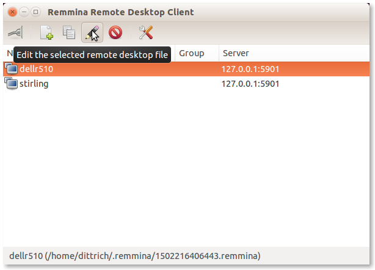

   Remmina Main Screen

..

Select **Create a new remote desktop file** (the sheet of paper with a green
``+`` sign) if this is the first time you are running Remmina. In this case, a
connection was already created so we will instead select **Edit** (the pencil
icon) to edit the settings. Save them when you are done to get back to the
main menu.

.. note::

   The password to use here is one set by the variable ``vnc_server_default``
   in the ``roles/vncserver/defaults/main.yml`` file.  As long as the VNC
   server is bound to ``localhost``, the risk is limited to the local system.
   For improved security, set this password to something strong by over-riding
   the default password with this variable in a private customization
   repository and/or Ansible Vault file using the techniques described in
   Section :ref:`localcustomization`.

..

.. _remmina_edit:

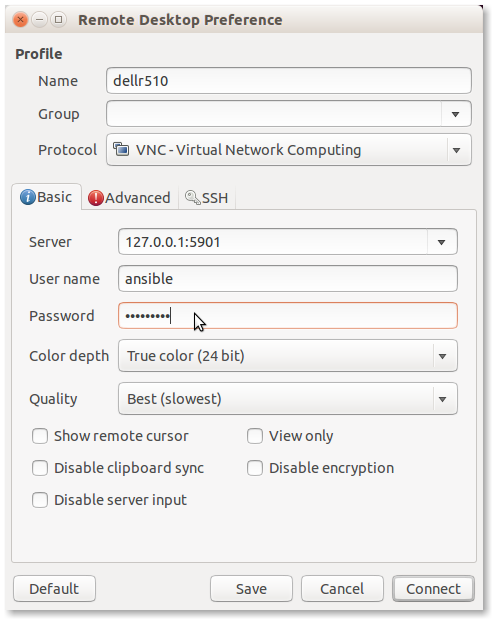

   Remmina Edit Screen

..

When you then select the item (``dellr510`` in this case) and press **Open the
connection to the selecetd remote desktop file** (the icon that looks like a
light switch on the far left of the icon bar), you should now have a graphical
desktop with a terminal window open on the remote host as seen here:

.. _vnc_connected_initial:

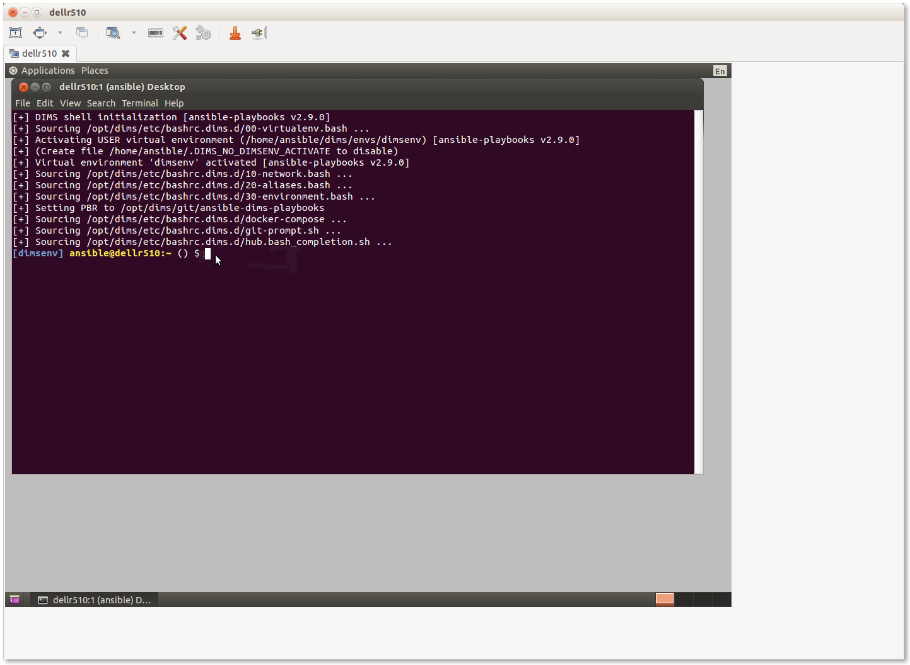

   Initial Remmina VNC Connection

..

.. _creating_vms:

Creating VMs
------------

The Ansible control host that was just set up can now be
used to control a set of virtual machines, bare metal hosts, or a combination.
It all depends on what services you wish to provide and how you chose to deploy
them.

There are several options for creating a hybrid "private-cloud" comprised
from a combination of bare-metal hosts, virtual machine hosts, and containerized
microservices. This flexibility comes at a cost in added complexity and
configuration management, but does afford for better linear horizontal
scalability and/or addition of compute or storage resources as the
system grows in size.

.. hint::

   For the bigger picture of architectural design options considered while
   designing and building the DIMS system components, see Section
   :ref:`dimsad:dimsarchitecturaldesign` of :ref:`dimsad:dimsad`.

..

Figure :ref:`VM-Architecture` shows a design similar to that being described in
this and the previous chapters.  The *Host* is shown at the bottom, comprised
of a highly-provisioned server, a base operating system and a virtual machine
hypervisor. Each virtual machine *Guest* is then created and installed with its
own combination of base operating system, libraries and binaries, and
application software. In this illustration, we see a single physical computer
with a total of six servers (4 Ubuntu Linux, 1 Red Hat Enterprise Linux, and 1
Debian Linux).

.. _VM-Architecture:

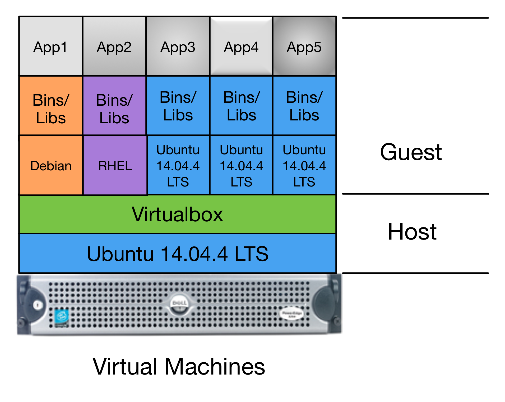

   Pure Virtual Machine Architecture

..

The deployment we are currently creating is even simpler than Figure
:ref:`VM-Architecture`.  There is the one bare-metal server acting as the
Ansible control host and Virtualbox hypervisor (``dellr510``) and just two
virtual machine guests (``yellow`` and ``purple``, a.k.a. the ``trident``
group). These guests will use bridged interfaces so they each have an
Internet-facing IP address and domain name, as well as a private virtual LAN
that is shared with the host for Ansible control and administration. For
increased security, the bare-metal VM host will only be accessible through an
internal VLAN.

.. _manual_install_vms:

Manual Installation of Virtual Machines
~~~~~~~~~~~~~~~~~~~~~~~~~~~~~~~~~~~~~~~

This section walks through the process of manually creating two
Debian 8.5 virtual machines to serve as Trident trust group
portal servers. This deployment combines all of the Trident
related services into one virtual machine. One of the two
vitual machines (``yellow``) will serve as the "production"
portal, and the other identical system (``purple``) will
serve as a development/test server. The latter can be used to
experiment with upgrades, test Ansible playbook changes,
train system administrators and trust group administrators.

Start the Virtualbox management GUI in the Remmina VNC
window.

.. _vnc_connected:

   Running Virtualbox management GUI over VNC

..

This should bring up the Virtualbox management GUI.

.. _remmina_virtualbox:

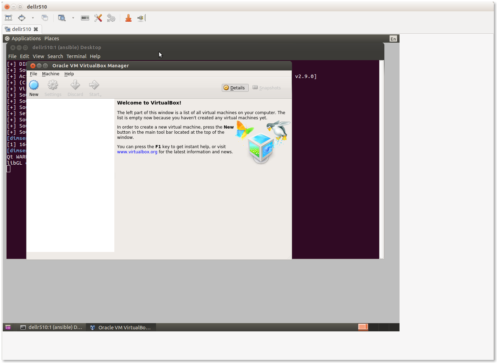

   Virtualbox management GUI

..

Select **New** to create a new virtual machine.  Most tabs have a **Next>**
button to go to the following tab, or select **Settings** after highlighting
the VM you want to configure, or and press the **Right mouse button** and chose
**Settings...** or use the keyboard shortcut **CTRL-S**.

.. _remmina_yellow_initial:

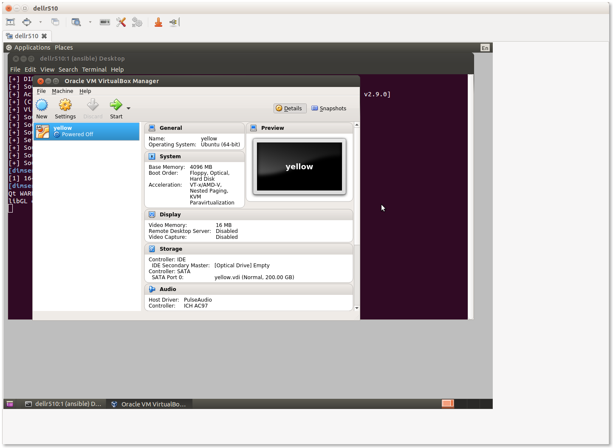

   Initial ``yellow`` VM

..

Individual groupings of settings (e.g., **System** for boot order, processor
settings, etc., **Storage** for virtual hard drives, **Network** for NICs) are
on the left of the **Settings** panel.

.. _remmina_vm_boot_order:

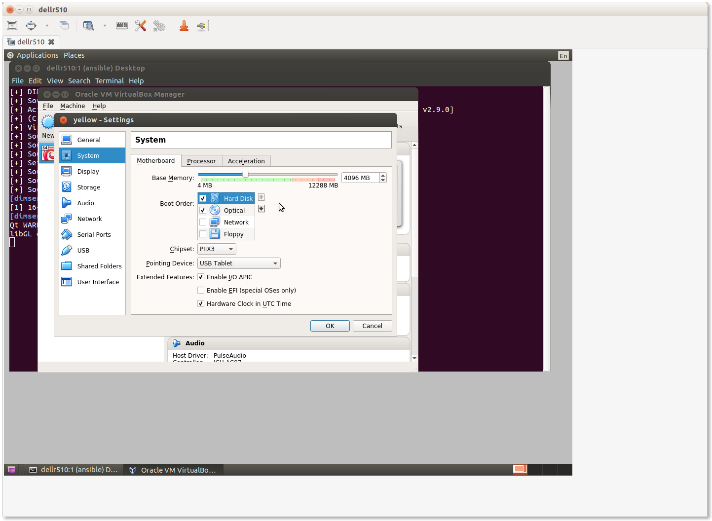

   VM System Settings

..

Navigate through the menus to set the following attributes:

    + Set Name: ``yellow``
    + Set Type: **Linux**
    + Set Version: **Ubuntu (64-bit)**
    + Set memory (e.g., **4096 MB**)
    + Create a virtual disk, type **VDI (VirtualBox Disk Image)**, dynamically
      allocated, making it generously large in relation to available disk space
      to provide adequate storage space for Trident upload files (e.g., **200GB**).
    + Configure three NICs:

        + Adapter **1** should be attached to **NAT** to provide host-only access with
          NAT to get to the Internet while setting up the VM.

        + Adapter **2** should be attached to **Bridged Adapter**, name ``em2`` in this
          case. (This is the host NIC attached to the internal VLAN in this configuration).
          This interface in the guest (``eth1``) will be used for local Ansible control
          and communication with internal hosts.

        + Adapter **3** should be attached to **Bridged Adapter**, name ``em1`` in this
          case.  (This is the host NIC attached to the Internet in this configuration,
          which will be set to ``0.0.0.0`` to prevent direct communication from the
          Internet to the VM host using this interface).  This interface in the guest
          (``eth2``) will have the public IP address for the Trident portal, email
          delivery, etc.

    + Set the system boot order to be **Hard Disk** first, followed by
      **Optical** drive. The first boot with an empty hard drive will boot from
      the **Optical** drive, while subsequent reboots will use the operating
      system installed on the **Hard Disk**.

    + Increase the number of CPUs (for a 16 core VM host, 3 or 4 cores is
      reasonable.)

.. note::

   All of these settings can be tuned later on if it is determined that they
   are too low (or too high). Use a program like ``htop`` on the virtual machine
   host to watch things like CPU saturation, memory saturation, swap usage,
   etc.

..

After configuring the first VM ``yellow``, produce a full clone of the VM and
name it ``purple``.  This will be the backup Trident server. Check the box to
regenerate MAC addresses for the network interfaces to ensure that they are
separable at the packet level in case network diagnostics need to be performed
using ``tcpdump`` or other network tools.

Once both of the VMs are set up, start them to boot from the Debian installation
ISO attached to the virtual DVD drive.

.. note::

   We are not using Kickstart here, as we did for the baremetal host in Section
   :ref:`bootstrapping`, which means that a number of steps that were
   automatically performed during system installation will need to be performed
   manually.  This is an area of automation that needs further work to unify
   and standardize the boot process using Kickstart from Jinja templates and
   inventory variables, allowing a consistent, configurable, repeatable, and
   much faster system setup. This will result in time and cost savings that
   scale better and help new teams more quickly deploy a full system.

..

* Use LVM on the entire drive, with separate partitions for ``/tmp``, ``/home``,
  and ``/var``.

* Choose **Debian desktop environment**, with **Gnome**, de-select **print
  server** and select **SSH server**, leaving **standard system utilities**
  selected, and press **Tab** and **Enter** to **Continue**.

* Create the ``ansible`` account using the password you created for this
  deployment. Also set the ``root`` password (ideally to a different password
  than the ``ansible`` account, to be used for emergency console access when
  and if something disables access to the ``ansible`` account.)

At the end of the operating system installation process, it will ask you
to reboot. The guest should then show the Grub boot menu and proceed
to boot into Debian, presenting the login screen when the system is up
and running.

.. _remmina_yellow_up:

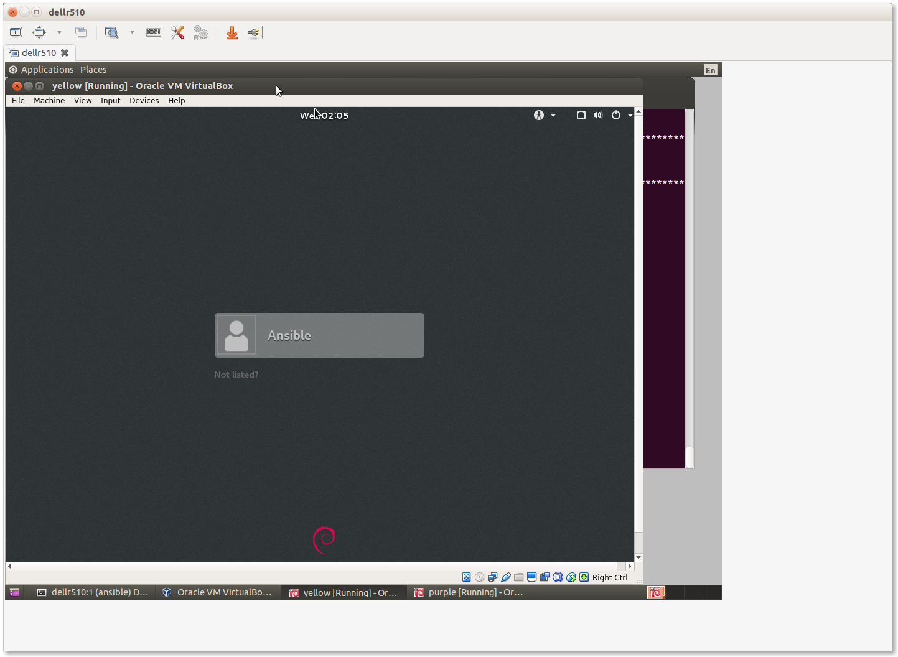

   Login screen for ``yellow`` VM

..

.. _bootstrapping_vms:

Bootstrapping the New VMs
~~~~~~~~~~~~~~~~~~~~~~~~~

Before you can perform the bootstrapping process using Ansible, you must
configure at least one network interface on each VM guest (as well as setting
an IP address in the same network block on the bridged interface of the host)
to allow host-to-guest SSH access.

Manually edit the ``/etc/network/interfaces`` file to configure the initial
``eth1`` NIC to have the IP addresses assigned for the hosts in the inventory
file. Bring the interface up using ``ifup eth1`` and test after setting up all
of the interfaces using the same steps as shown in Section
:ref:`full_network_connectivity`.

Once connectivity has been verified, apply the ``bootstrap.yml`` playbook
as shown in Section :ref:`bootstrapping_ansible_control`, using the
``trident`` group this time to bootstrap both VMs at the same time.

.. _remmina_bootstrap_trident:

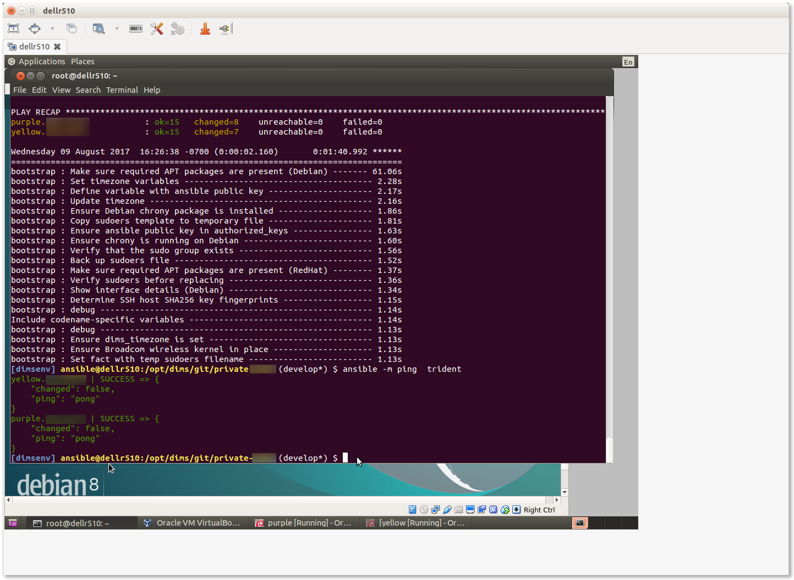

   Bootstrapping the ``trident`` group

..

.. _initial_provision_vms:

Initial Provisioning of the New VMs
~~~~~~~~~~~~~~~~~~~~~~~~~~~~~~~~~~~

Lastly, we will run the initial provisioning steps to install and configure
the two new VMs. For the purposes of this example, we will start by only
applying the ``base`` role tasks to make sure the fundamentals of our
customized configuration will work. The command we use is:

.. code-block:: none

    $ ansible-playbook $GIT/private-develop/master.yml --tags base --limit trident

..

.. _remmina_base_role:

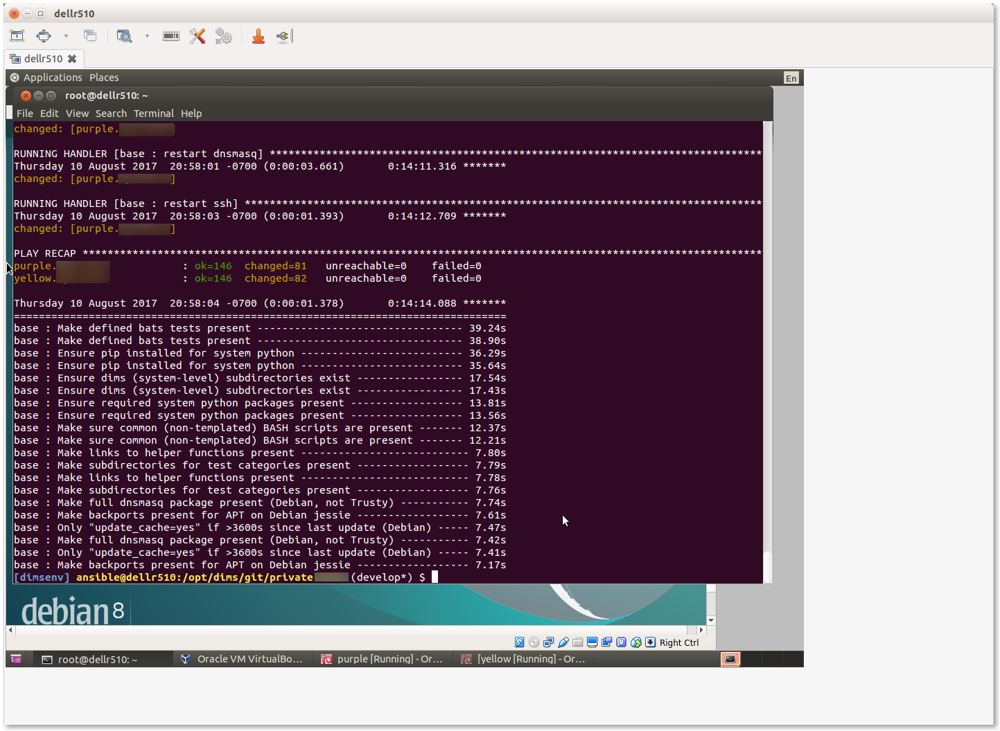

   Applying ``base`` role to ``trident`` group

..

Having applied the ``base`` role, network interfaces are set up,
``iptables`` rules are in place, ``/etc/hosts`` file and DNS
resolution are configured, and packages have been updated. This would
be a good time to reboot both systems to ensure everything is applied
and functions. You can use Ansible ad-hoc mode to do this with
the command:

.. code-block:: none

    $ ansible -m shell --become -a 'shutdown -r now' trident`

..

After a minute or two, you can test connectivity again with the
command:

.. code-block:: none

    $ ansible -m shell -a 'uptime' trident`
    purple.devops.develop | SUCCESS | rc=0 >>
     14:22:33 up 0 min,  1 user,  load average: 0.86, 0.22, 0.07

    yellow.devops.develop | SUCCESS | rc=0 >>
     14:22:33 up 0 min,  1 user,  load average: 0.79, 0.25, 0.09

..

At this point, the hosts are ready for application of their full playbooks.
Use ``--limit trident`` when running the ``master.yml`` playbook to only
operate on the two VMs in question.

.. note::

   If Ansible Vault is being used to encrypt any secrets on disk, you will
   need to either provide the password using the ``--ask-vault-pass``
   command line option or provide a path to the Vault password file
   using the ``--vault-password-file`` command line option. We will use
   the latter in this example:

.. _remmina_trident_fullplaybook_start:

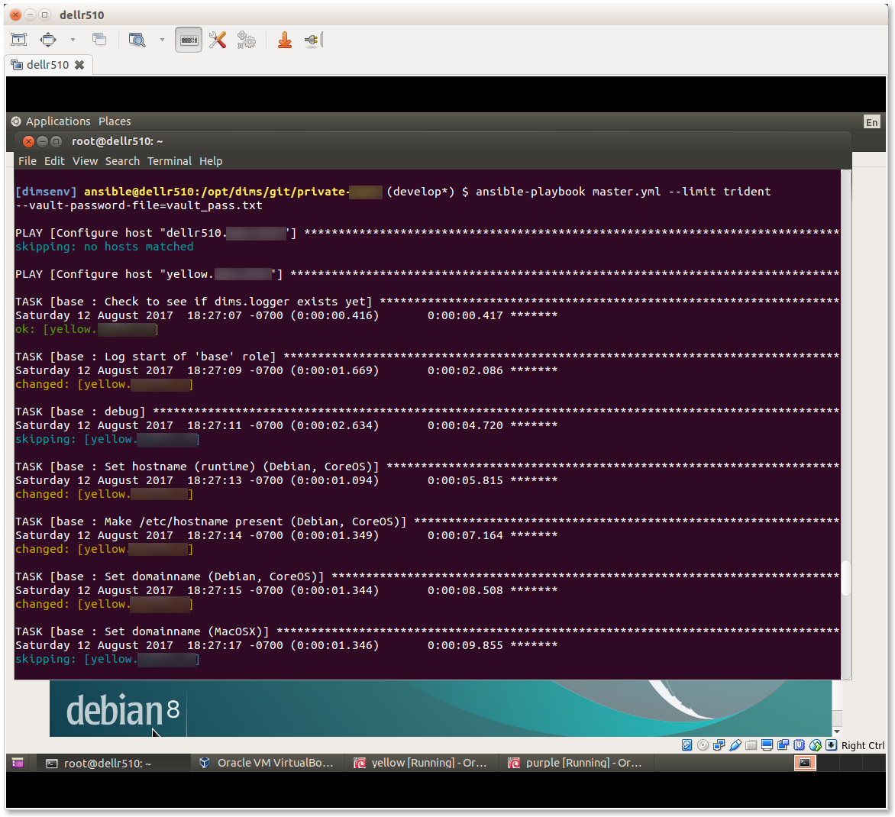

   Applying full playbook to ``trident`` group

..

.. attention::

    The ``nginx`` role is designed to support use of Letsencrypt for SSL
    certificate generation. Because Letsencrypt imposes a limit on the number of
    certificates that can be generated for a given DNS domain name per week,
    the default is to use the "staging" facility (i.e., the default is
    ``certbot_staging: yes`` globally.) It may take a few full playbook
    runs to ensure that all variables are defined and set properly, which
    could exhaust the limit of certificates if the default was to generate
    real certificates each time the ``nginx`` role gets applied.

    After you are sure things are working properly, edit the
    ``inventory/trident/nodes.yml`` file and change the setting to
    ``certbot_staging: no`` and apply the ``nginx`` role one more time to get
    valid certificates.

    Once valid certificates have been generated once, you can create a backup
    that can be restored later for development testing purposes in case you
    have to destroy the ``/etc/letsencrypt`` directory and start again (as
    occurs when using Vagrants and doing ``vagrant destroy``, or terminating
    virtual machines in cloud service providers.) This process is described
    in Chapter :ref:`creating_a_backup`.

..

.. _remmina_trident_fullplaybook_summary:

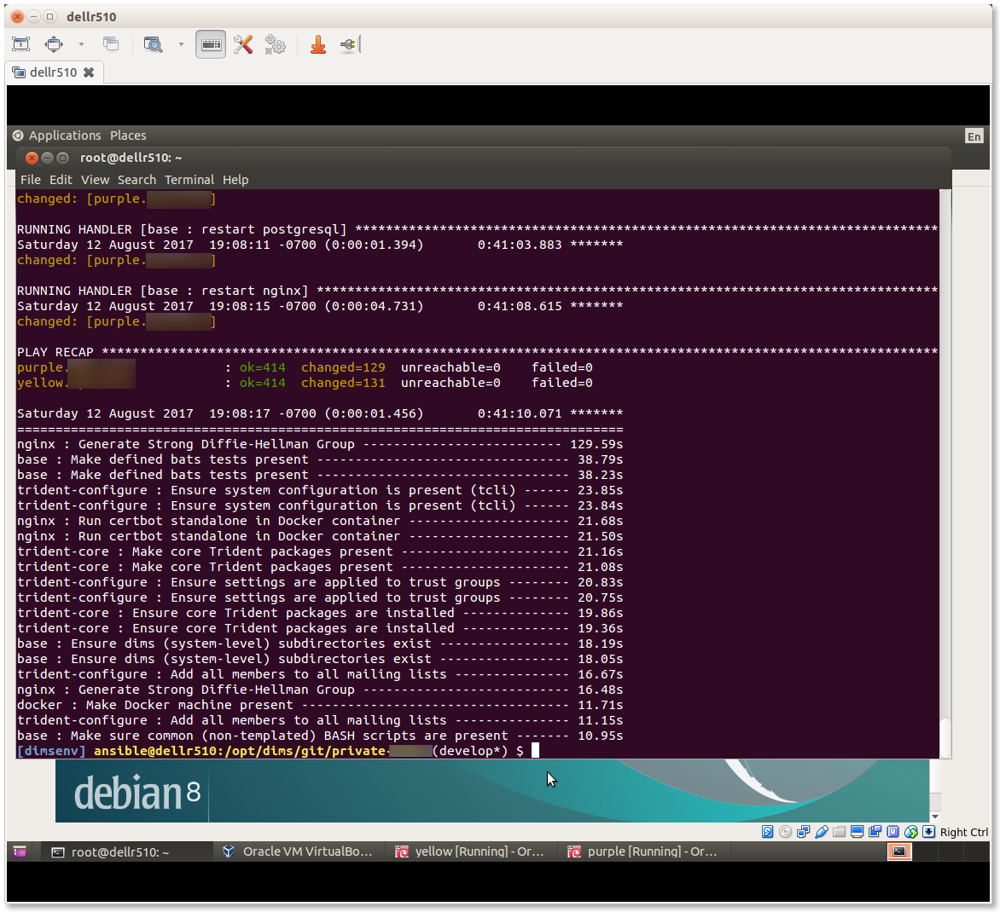

   Summary of full playbook run

..

This completes the installation of the two VMs.

.. attention::

    As these VMs were created using a NAT interface, but are meant to normally
    operate using a bridged adapter for Internet facing access to the portal
    and for email processing, one last configuration change is to disable the
    ``eth0`` NAT interface so its DHCP assigned default route does not conflict with
    the default gateway setting of the ``eth2`` interface. To do this, you will
    need to go the **Settings** tab, then unselect **Cable connected** for
    **Adapter 1** on each VM as shown in Figure :ref:`remmina_disconnect_eth0_cable`.

..

.. _remmina_disconnect_eth0_cable:

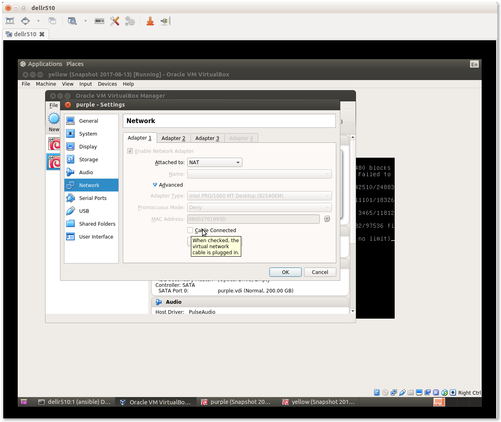

   Disconecting cable to NAT interface

..

At this point, it would be a good idea to create snapshots of the VMs in this
initial working state to have something to fall back on in case of mistakes at
a later date.  This is shown in Figure :ref:`remmina_snapshots` and the steps
to perform are described in `How to use snapshots in VirtualBox`_ and the
Virtualbox document, `Chapter 1. First steps`_.

.. _remmina_snapshots:

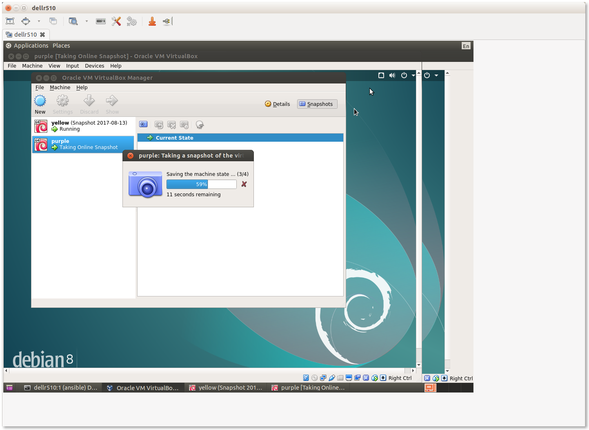

   Creating Snapshots in Virtualbox

..

.. _Letsencrypt: https://letsencrypt.org/
.. _How to use snapshots in VirtualBox: http://www.techrepublic.com/article/how-to-use-snapshots-in-virtualbox/
.. _Chapter 1. First steps: https://www.virtualbox.org/manual/ch01.html
